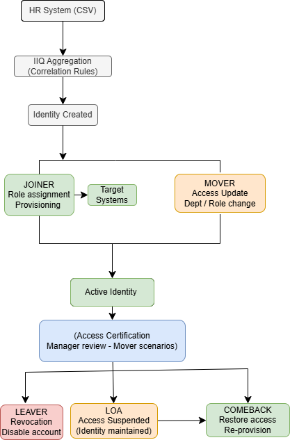

# SailPoint IIQ — Identity Lifecycle Demo
> Based on hands-on work at BNP Paribas · Synetis (Oct 2023 – Feb 2024)  
> *Reference letter available upon request*

## Overview

This project documents a simplified IAM lifecycle based on hands-on experience 
with SailPoint IdentityIQ at **BNP Paribas** (via Synetis) — one of Europe's 
largest regulated banking environments.

It covers the full employee lifecycle: Joiner, Mover, Leaver, Leave of Absence, 
and ComeBack scenarios, reflecting real enterprise conditions.

---

## Lifecycle Flow

---

## Scenarios Covered

### Joiner
- HR CSV onboarding with identity attribute mapping
- Correlation rules linking accounts to identities
- Role assignment and automated provisioning to target systems

### Mover
- Department or role change triggers access update
- Existing access reviewed and adjusted to new profile

### Leaver
- Access revocation across all provisioned systems
- Account suspension or removal

### Leave of Absence (LOA)
- Temporary access suspension while preserving identity
- Automated workflow triggered by HR event

### ComeBack
- Access restoration after return from leave
- Re-provisioning based on current role and entitlements

### Access Certification
- Manager review campaigns to validate active entitlements
- Least-privilege enforcement in a regulated banking context

---

## My Contribution at BNP Paribas

**Directly implemented**
- Leave of Absence (LOA) workflow — temporary access suspension via HR event trigger in IIQ
- ComeBack workflow — access restoration and re-provisioning after return from leave in IIQ
- Wrote BeanShell aggregation rules for identity data processing
- Set up CSV onboarding and identity model configuration
- Access certification campaigns — Mover scenarios configuration (least-privilege enforcement)
- Performed unit testing and UAT support
- Notification templates (EmailTemplate) using Velocity
- IdentityIQ UI customization (branding, HTML/CSS) to align with client standards
- Technical documentation (admin guides, spec updates)

**Participated in (testing & UAT):**
- Joiner workflow — identity creation and role assignment
- Mover workflow — access update on department change
- Leaver workflow — access revocation and account suspension
- Red button — emergency access revocation

---

## Technologies

- SailPoint IdentityIQ · BeanShell · XML configuration
- Identity lifecycle (JML) · Access certification · Provisioning
- CSV aggregation · Correlation rules

---

## Project Files

| File | Description |
|---|---|
| `/rules/correlation-rule.bsh` | BeanShell rule — identity matching by employeeId or email |
| `/data/hr-sample.csv` | Sample HR onboarding file with JML event types |
| `/workflows/loa-comeback-workflow-spec.md` | Technical spec for Leave of Absence and Comeback workflows |

---

## Note
This project reproduces IAM lifecycle patterns from a regulated banking environment.  
Code samples (BeanShell rules, CSV structure) reflect actual implementation approaches  
used during the mission — anonymized for confidentiality.

---

## Current Focus

Upskilling on **SailPoint Identity Security Cloud (ISC)** — 
cloud-native identity governance and lifecycle management.
